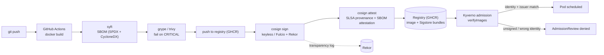

# Provenance Pipeline

Software supply-chain pipeline: build → SBOM → vulnerability scan → keyless signature → SLSA provenance attestation → admission control that refuses anything unsigned.

> **Status:** both halves are built and verified on a real cluster. Every push to
> `main` produces a signed, attested image, and a Kubernetes cluster running
> Kyverno in `Enforce` refuses anything it cannot trace back to that pipeline.
> Captured proof:
> [supply-chain-verification.md](docs/evidence/supply-chain-verification.md) (CI)
> and [admission-enforcement.md](docs/evidence/admission-enforcement.md) (cluster).

---

## The rejection


Four pods, one policy, `Enforce` with `failurePolicy: Fail`:

| Image | Outcome |
|---|---|
| ours, by digest, signed by the release workflow | **admitted**, running |
| `busybox`, by digest — an ordinary unsigned image | **denied** |
| `kyverno`, by digest — really signed, really in Rekor, **wrong identity** | **denied** |
| ours, by **tag** instead of digest | **denied** |

The third row is the one worth pausing on. `reg.kyverno.io/kyverno/kyverno` is
genuinely Sigstore-signed and its entry is genuinely in the public transparency
log. It is refused anyway, because the signature is not *ours*. A policy that
only checks "is this signed" would have admitted it.

## Why

"We scan our images" is table stakes and proves nothing at runtime. This repo closes the loop: the cluster itself refuses to run an image whose signature and provenance it cannot verify against the expected identity. The interesting artifact is not the pipeline — it is the rejection.

## Architecture



Details: [docs/architecture.md](docs/architecture.md).

## Threat model

Full version in [docs/threat-model.md](docs/threat-model.md).

| # | Threat | Control |
|---|--------|---------|
| T1 | Attacker pushes a malicious image to the registry | Admission requires a cosign signature bound to this repo's OIDC identity; a registry-only writer cannot forge it |
| T2 | Compromised base image / vulnerable dependency | SBOM per build + `grype` gate; SBOM attestation lets us re-query old images when a new CVE drops |
| T3 | Build system tampering (injected step) | SLSA provenance attestation records builder ID, source ref, and materials; policy asserts the expected builder |
| T4 | Signing key theft | Keyless signing — ephemeral Fulcio cert, no long-lived key to steal |
| T5 | Signature stripped / replayed on a different image | Signature is over the image digest; policy pins digests, tags are not trusted |
| T6 | Policy bypass via a namespace exempted from admission | Kyverno policy in `Enforce` with `failurePolicy: Fail`; exclusions enumerated and argued inline. Background scanning is off — image verification needs a registry round trip and only runs at admission |
| T7 | Silent signing (nobody notices a rogue signature) | Rekor transparency log; provenance queries documented in the runbook |

## Layout

```
app/                  # minimal demo service being built and signed  (built)
build/                # Dockerfile, build config                     (built)
docs/evidence/        # captured output, generated not transcribed   (built)
policies/kyverno/     # verifyImages ClusterPolicy (Enforce)         (built)
policies/verify/      # cosign verify invocations used by hand       (superseded by the Makefile)
cluster/bootstrap/    # Kyverno install + its NetworkPolicy          (built)
scripts/              # demo.sh + evidence collection                (built)
tests/                # policy tests, allow and deny paths           (built)
```

## What is proven today

Every push to `main` runs [`release.yml`](.github/workflows/release.yml), which
builds the image, generates an SBOM with `syft`, fails the build on any CRITICAL
finding from `grype`, signs the digest keyless with `cosign`, and attaches two
attestations — the SBOM and a SLSA v1 provenance predicate. A separate `verify`
job then re-checks all of it from scratch, pinning both the certificate identity
and the OIDC issuer.

That job also runs a **negative control**: `cosign verify` against a digest that
was never signed, failing the build if it succeeds. Without it a green run only
proves the happy path, and a verifier that never says no is not a verifier.

Real captured output, including the Rekor entries:
[docs/evidence/supply-chain-verification.md](docs/evidence/supply-chain-verification.md).

```bash
make verify
```

The GHCR package is public, so this needs no credential at all — it was verified
from a cluster node that has never logged in to a registry.

On the cluster side, Kyverno v1.18.2 runs the same trust decision at admission.
The policy pins **both** the certificate identity and the OIDC issuer; each was
corrupted in turn and each turned an admitted pod into a denied one, which is the
only way to know a pin is load-bearing rather than decorative.

```bash
make policy-install   # Kyverno, upstream sha256-enforced, images digest-pinned
make policy-test      # 9 assertions: 2 admit, 2 deny, 1 must-not-match
make demo             # the recording above
```

## What is not proven

- **The source was benign.** Provenance says where an artifact came from, never
  that what came from there was safe. Threat model T3, and no SLSA level changes it.
- **Every namespace.** The deny-everything-unsigned rule is opt-in by namespace
  label, because this cluster belongs to [KateClusters](../KateClusters) and runs
  workloads from other pipelines that a cluster-wide rule would break on their
  next restart. `kube-system`, `kyverno`, `calico-system` and `tigera-operator`
  are excluded from the other rule and each exclusion is argued in the policy file.
- **Independence from GitHub's attestation step.** Of the four Sigstore bundles
  attached to each image, Kyverno can discover only the one written by
  `actions/attest-build-provenance`, and that step is gated on the repository
  being public. Make the repo private and enforcement denies everything. This is
  the largest open weakness in the design — ADR-009 and
  [B5](docs/BLOCKED.md).
- **MEDIUM and HIGH vulnerabilities ship.** The gate fails at CRITICAL only. T2.
- **Rekor monitoring.** T7 has no automation behind it.

## Roadmap

- [x] `app/` + `build/Dockerfile` — small, reproducible demo service
- [x] CI: build → `syft` SBOM → `grype` gate
- [x] CI: `cosign sign` keyless + `cosign attest` (SLSA provenance, SBOM)
- [x] `verify` job + captured evidence, with a negative control
- [x] `cluster/bootstrap` — Kyverno install (targets the KateClusters node)
- [x] `policies/kyverno` — `verifyImages` with issuer + subject pinning, Enforce
- [x] `tests/` — policy tests for allow and deny paths
- [x] Negative-path demo + GIF
- [x] Writeup: what SLSA level this actually reaches, and what it does not
- [ ] Remove the dependency on repository visibility (B5)
- [ ] Scheduled re-scan of published digests, so a new CVE against a shipped
      image surfaces without a rebuild

## SLSA level, honestly

Build L2, not L3, and the gap is not a technicality.

L2 wants a hosted build platform producing signed provenance that a consumer can
verify. That is met: GitHub-hosted runners, provenance signed through Fulcio with
the workflow's own OIDC identity, entries in public Rekor, verifiable by
`cosign verify-attestation` against a pinned identity and issuer.

L3 additionally wants the provenance to be unforgeable *by the build itself* —
generated in an isolated context the workflow's own steps cannot reach. Here the
predicate is assembled by a step in the same job that builds the image, so any
compromise of that job can write whatever provenance it likes. Reaching L3 means
delegating to a trusted generator such as `slsa-framework/slsa-github-generator`.

The [threat model](docs/threat-model.md) states the same limit in T3: provenance
proves *where* an artifact came from, never that the source was benign.

**What the cluster half adds to that claim, and what it does not.** SLSA levels
describe how an artifact is *produced*; nothing in L1–L4 is about whether anyone
checks the provenance before running it. Enforcing it at admission does not raise
the level — the build is still L2 — but it is the step that makes the level mean
anything operationally. A signed L3 artifact nobody verifies is worth less than a
verified L2 one. So: **Build L2, verified at admission.** Both halves of that
sentence are load-bearing, and neither is worth more than it says.

## Picking this up

[docs/PROVEhandoff.md](docs/PROVEhandoff.md) — current state, the next steps in
order, the blockers with their exact fixes, and the limitations stated plainly.
[docs/HANDBOOK.md](docs/HANDBOOK.md) — how the CI half was built, start to finish.
[docs/PROGRESS.md](docs/PROGRESS.md) — what is done cluster-side, verified, with
the dead ends recorded so they are not retried.
[docs/demo-recording.md](docs/demo-recording.md) — how the GIF above was made,
written to be reused by the sibling repos.

## Related

Runs on the cluster from [KateClusters](../KateClusters). Images are consumed there; the policies live here.
