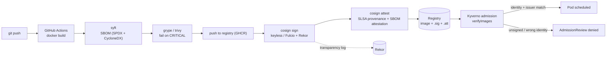

# Provenance Pipeline

Software supply-chain pipeline: build → SBOM → vulnerability scan → keyless signature → SLSA provenance attestation → admission control that refuses anything unsigned.

> **Status:** the CI half is built and verified — every push to `main` produces a
> signed, attested image whose provenance is checkable from the command line.
> The admission-control half is not built; it is blocked on a cluster.
> Captured proof: [docs/evidence/supply-chain-verification.md](docs/evidence/supply-chain-verification.md).

---

## Why

"We scan our images" is table stakes and proves nothing at runtime. This repo closes the loop: the cluster itself refuses to run an image whose signature and provenance it cannot verify against the expected identity. The interesting artifact is not the pipeline — it is the rejection.

## Architecture



Details: [docs/architecture.md](docs/architecture.md).

## Threat model

Full version in [docs/threat-model.md](docs/threat-model.md).

| # | Threat | Control |
|---|--------|---------|
| T1 | Attacker pushes a malicious image to the registry | Admission requires a cosign signature bound to this repo's OIDC identity; a registry-only writer cannot forge it |
| T2 | Compromised base image / vulnerable dependency | SBOM per build + `grype` gate; SBOM attestation lets us re-query old images when a new CVE drops |
| T3 | Build system tampering (injected step) | SLSA provenance attestation records builder ID, source ref, and materials; policy asserts the expected builder |
| T4 | Signing key theft | Keyless signing — ephemeral Fulcio cert, no long-lived key to steal |
| T5 | Signature stripped / replayed on a different image | Signature is over the image digest; policy pins digests, tags are not trusted |
| T6 | Policy bypass via a namespace exempted from admission | Kyverno policy in `Enforce` mode, background scan on, exclusions enumerated and reviewed |
| T7 | Silent signing (nobody notices a rogue signature) | Rekor transparency log; provenance queries documented in the runbook |

## Layout

```
app/                  # minimal demo service being built and signed  (built)
build/                # Dockerfile, build config                     (built)
docs/evidence/        # captured cosign output, generated by CI      (built)
policies/kyverno/     # verifyImages ClusterPolicy (enforce)         (blocked: no cluster)
policies/verify/      # cosign verify invocations used by hand       (superseded by the Makefile)
cluster/bootstrap/    # Kyverno install + policy apply               (blocked: no cluster)
scripts/              # evidence collection; demo helpers            (partial)
tests/                # policy unit tests (kyverno-cli / chainsaw)   (blocked: no policies yet)
```

## What is proven today

Every push to `main` runs [`release.yml`](.github/workflows/release.yml), which
builds the image, generates an SBOM with `syft`, fails the build on any CRITICAL
finding from `grype`, signs the digest keyless with `cosign`, and attaches two
attestations — the SBOM and a SLSA v1 provenance predicate. A separate `verify`
job then re-checks all of it from scratch, pinning both the certificate identity
and the OIDC issuer.

That job also runs a **negative control**: `cosign verify` against a digest that
was never signed, failing the build if it succeeds. Without it a green run only
proves the happy path, and a verifier that never says no is not a verifier.

Real captured output, including the Rekor entries:
[docs/evidence/supply-chain-verification.md](docs/evidence/supply-chain-verification.md).

```bash
make verify
```

Reading the image back from GHCR needs a token with `read:packages` while the
package is private (`gh auth refresh -h github.com -s read:packages`). The CI
`verify` job runs the same commands on every push and needs no local setup.

## What is not proven yet

The rejection. Nothing here shows a **cluster** refusing an unsigned image,
because there is no cluster yet — that is [KateClusters](../KateClusters), and
it is not built. Until then this repository demonstrates verifiable provenance,
not enforcement, and the difference is the entire point of the project.

The demo GIF below is unrecorded for that reason, and because local keyless
signing is interactive by design. Details in [docs/BLOCKED.md](docs/BLOCKED.md).

1. `kubectl run` a **signed** image → scheduled.
2. `kubectl run` the **same image, unsigned** (or signed by a different identity) → admission webhook denies with the policy message.
3. `cosign verify-attestation` on the good image → SLSA provenance printed, Rekor entry linked.

## Roadmap

- [x] `app/` + `build/Dockerfile` — small, reproducible demo service
- [x] CI: build → `syft` SBOM → `grype` gate
- [x] CI: `cosign sign` keyless + `cosign attest` (SLSA provenance, SBOM)
- [x] `verify` job + captured evidence, with a negative control
- [ ] `cluster/bootstrap` — Kyverno install (targets the KateClusters node)
- [ ] `policies/kyverno` — `verifyImages` with issuer + subject pinning, Enforce
- [ ] `tests/` — policy tests for allow and deny paths
- [ ] Negative-path demo + GIF
- [ ] Writeup: what SLSA level this actually reaches, and what it does not

## SLSA level, honestly

Build L2, not L3, and the gap is not a technicality.

L2 wants a hosted build platform producing signed provenance that a consumer can
verify. That is met: GitHub-hosted runners, provenance signed through Fulcio with
the workflow's own OIDC identity, entries in public Rekor, verifiable by
`cosign verify-attestation` against a pinned identity and issuer.

L3 additionally wants the provenance to be unforgeable *by the build itself* —
generated in an isolated context the workflow's own steps cannot reach. Here the
predicate is assembled by a step in the same job that builds the image, so any
compromise of that job can write whatever provenance it likes. Reaching L3 means
delegating to a trusted generator such as `slsa-framework/slsa-github-generator`.

The [threat model](docs/threat-model.md) states the same limit in T3: provenance
proves *where* an artifact came from, never that the source was benign.

## Picking this up

[docs/PROVEhandoff.md](docs/PROVEhandoff.md) — current state, the next steps in
order, the blockers with their exact fixes, and the limitations stated plainly.
[docs/HANDBOOK.md](docs/HANDBOOK.md) — how the CI half was built, start to finish.

## Related

Runs on the cluster from [KateClusters](../KateClusters). Images are consumed there; the policies live here.
