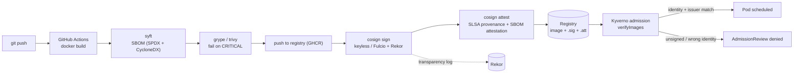
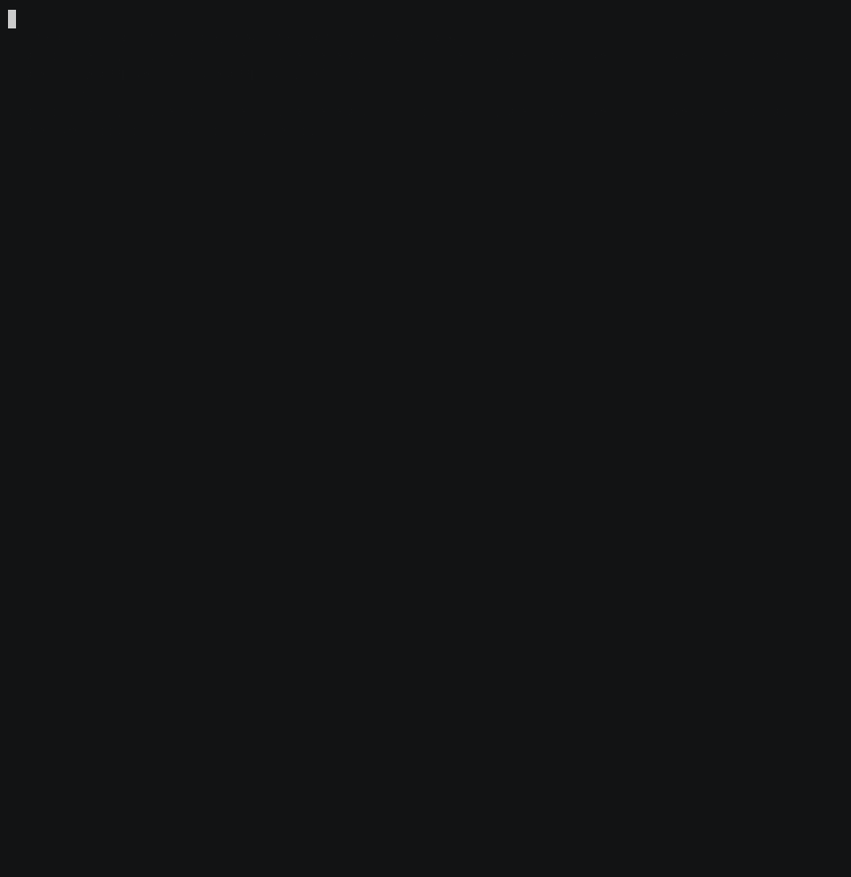

# Provenance Pipeline

Software supply-chain pipeline: build → SBOM → vulnerability scan → keyless signature → SLSA provenance attestation → admission control that refuses anything unsigned.

> **Status:** scaffolding. See [Roadmap](#roadmap).

---

## Why

"We scan our images" is table stakes and proves nothing at runtime. This repo closes the loop: the cluster itself refuses to run an image whose signature and provenance it cannot verify against the expected identity. The interesting artifact is not the pipeline — it is the rejection.

## Architecture



Details: [docs/architecture.md](docs/architecture.md).

## Threat model

Full version in [docs/threat-model.md](docs/threat-model.md).

| # | Threat | Control |
|---|--------|---------|
| T1 | Attacker pushes a malicious image to the registry | Admission requires a cosign signature bound to this repo's OIDC identity; a registry-only writer cannot forge it |
| T2 | Compromised base image / vulnerable dependency | SBOM per build + `grype` gate; SBOM attestation lets us re-query old images when a new CVE drops |
| T3 | Build system tampering (injected step) | SLSA provenance attestation records builder ID, source ref, and materials; policy asserts the expected builder |
| T4 | Signing key theft | Keyless signing — ephemeral Fulcio cert, no long-lived key to steal |
| T5 | Signature stripped / replayed on a different image | Signature is over the image digest; policy pins digests, tags are not trusted |
| T6 | Policy bypass via a namespace exempted from admission | Kyverno policy in `Enforce` mode, background scan on, exclusions enumerated and reviewed |
| T7 | Silent signing (nobody notices a rogue signature) | Rekor transparency log; provenance queries documented in the runbook |

## Layout

```
app/                  # minimal demo service being built and signed
build/                # Dockerfile, build config
policies/kyverno/     # verifyImages ClusterPolicy (enforce)
policies/verify/      # cosign verify / verify-attestation invocations used in CI and by hand
cluster/bootstrap/    # Kyverno install + policy apply
scripts/              # sbom, scan, sign, attest helpers
tests/                # policy unit tests (kyverno-cli / chainsaw)
```

## The demo

The whole point. Recorded as a GIF:

1. `kubectl run` a **signed** image → scheduled.
2. `kubectl run` the **same image, unsigned** (or signed by a different identity) → admission webhook denies with the policy message.
3. `cosign verify-attestation` on the good image → SLSA provenance printed, Rekor entry linked.



## Roadmap

- [ ] `app/` + `build/Dockerfile` — small, reproducible demo service
- [ ] CI: build → `syft` SBOM → `grype` gate
- [ ] CI: `cosign sign` keyless + `cosign attest` (SLSA provenance, SBOM)
- [ ] `cluster/bootstrap` — Kyverno install (targets the BastionCluster node)
- [ ] `policies/kyverno` — `verifyImages` with issuer + subject pinning, Enforce
- [ ] `tests/` — policy tests for allow and deny paths
- [ ] Negative-path demo + GIF
- [ ] Writeup: what SLSA level this actually reaches, and what it does not

## Related

Runs on the cluster from [BastionCluster](../BastionCluster). Images are consumed there; the policies live here.
